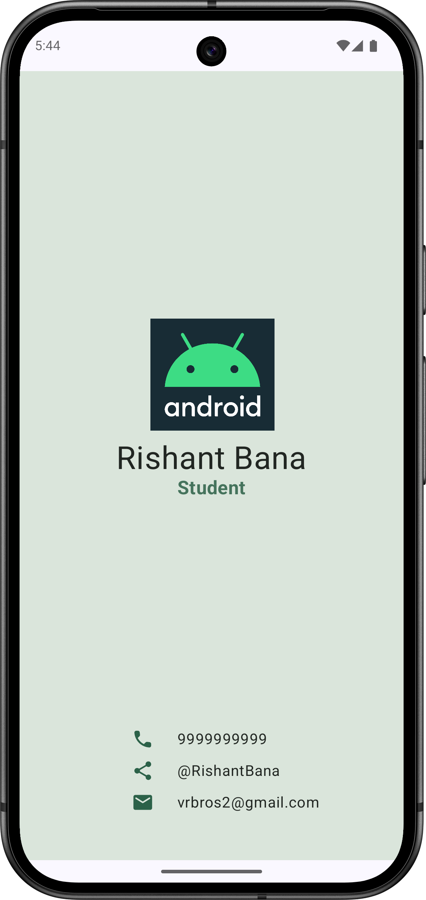

Here's a basic structure for your README file:

---

# Business Card App

This is a simple business card application developed using Kotlin and Jetpack Compose. It displays contact details such as name, title, phone number, email, and social media links in a visually appealing and minimalistic UI. This project was created as part of Google's Android Basics with Compose course.

## Features

- **Customizable Info**: Easily change the contact details like name, title, phone, email, and social media links.
- **Jetpack Compose**: Utilizes the modern Jetpack Compose UI toolkit to build the user interface.
- **Edge-to-Edge Display**: Full-screen design with edge-to-edge layout for a sleek and modern look.
- **Responsive UI**: The app is designed to be responsive and adjusts well to different screen sizes.

## Screenshots



## Installation

To run this app, follow these steps:

1. Clone this repository:
    ```bash
    git clone https://github.com/RishantBana/business-card-app.git
    ```

2. Open the project in **Android Studio**.

3. Make sure you have the latest version of **Kotlin** and **Jetpack Compose**.

4. Run the project on an emulator or a physical device.

## Configuration

You can easily modify the contact information by updating the strings in the `res/values/strings.xml` file:

```xml
<string name="name">Your Name</string>
<string name="title">Your Job Title</string>
<string name="phone">Your Phone Number</string>
<string name="email">Your Email</string>
<string name="social">Your Social Media Link</string>
<string name="android">Android Developer</string>
```

## Tech Stack

- **Kotlin**: The primary language for building the app.
- **Jetpack Compose**: A modern toolkit for building native UIs.
- **Android Studio**: The IDE for Android development.

## Contributing

Feel free to fork this repository and submit pull requests for any improvements or features you'd like to add.


---

Feel free to modify any sections (like the screenshots or the contributing section) as per your project needs!
